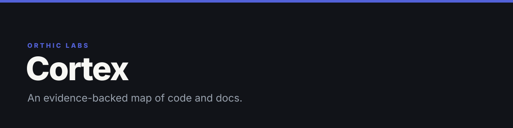

**Cortex turns code and documentation into a local, evidence-backed repository map, so people and agents can find what is true, stale, contradictory, or still unknown before changing a system.**

Nodes, edges, and flows are branded **Neurons**, **Synapses**, and **Circuits**.

[](LICENSE) [](#local-sqlite-graph)

## What it is

Cortex reads a repository's architecture docs, plans, ADRs, source files, symbols, calls, tests, and config, then shows which conclusions are supported, stale, contradictory, or still unknown. Code tells part of a system's story and docs tell another part, and neither stays trustworthy unless the two are compared against each other. Cortex runs that comparison and keeps every conclusion attached to exact evidence.

## How it works

```text
documents + code + tests + config
                 │
                 ▼
       deterministic repository map
                 │
                 ▼
       local SQLite evidence graph
                 │
                 ▼
      claim verification + synthesis
                 │
                 ├── machine artifacts for agents
                 └── product + architecture docs for humans
```

Cortex runs in two phases:

1. Map — deterministic code maps documents, claims, files, symbols, and relationships into a generation-bound graph.
2. Understand — evidence-bound verification checks document claims against source, then synthesizes architecture, interfaces, security, health, production readiness, and uncovered flows.

Mapping is cheap and repeatable. Higher-level conclusions stay attached to exact evidence rather than floating free of it.

## Quick start

```sh
npm install   # or pnpm install
python3 -m pip install -r requirements-test.txt
npm test                # standalone package tests (tests/*.test.mjs)
npm run test:workspace  # monorepo context-contract suite (tests/workspace/)
npm run test:all        # both, serialized for watcher/performance isolation
```

Requires Node `>=20`; full tests also need Python `>=3.11` plus the packages in `requirements-test.txt` (the workspace context-contract suite shells out to `jsonschema`). CLI entry point: `cortex`.

```sh
cortex                         # complete Cortex workflow
cortex "<task>"                # task-focused repository understanding
cortex doctor --full --json    # freshness, coverage, and artifact health

cortex graph search --query "authentication"
cortex graph neighbors --node "<node-id>"
cortex graph path --from "<node-id>" --to "<node-id>"
cortex graph impact --node "<node-id>"
cortex graph architecture
cortex graph doc-truth
cortex graph export
```

Cortex can also emit a bounded `ContextCandidateSet` for a larger context planner: a task-relevant slice with evidence and freshness attached, not the whole graph.

## Document truth

Cortex treats documentation as data, not decoration. It reads current docs, ADRs, plans, and configured archives, then:

- extracts individual claims with source paths and line evidence;
- links claims to mentioned code, symbols, and candidate verification files;
- records document lifecycle as current, historical, superseded, or invalidly marked;
- keeps superseded docs as provenance while excluding them from current truth;
- applies precedence so an old plan cannot outrank current code;
- joins evidence as `supports`, `contradicts`, or `supersedes`;
- flags stale references, unsupported claims, and code-versus-doc disagreement;
- excludes its own generated docs from future claim extraction, so it cannot confirm itself in a loop.

Phase 2 seals each verdict to exact document and code fingerprints. When inputs are unchanged, Cortex reuses the verdict; when one claim or file changes, only the affected verdicts and synthesis dimensions recompute. Reconciliation records keep disagreements visible until a person decides whether code or docs should change.

## Local SQLite graph

Each mapped repository gets one derived, gitignored store: `.agent/graph/graph.db`. Cortex uses Node's built-in `node:sqlite`, so the core store needs no database server or native SQLite package.

| Table | What it stores | Important indexes |
|---|---|---|
| `files` | paths, hashes, languages, parse status, file-node data | generation |
| `symbols` | functions, types, components, routes, other named code objects | path, generation |
| `edges` | imports, calls, references, containment, config, other relationships | source, target, kind, confidence tier, generation |
| `generation` | manifest, provider composition, document truth, source observation | key |
| `meta` | store schema version | key |
| `vectors` | optional future embeddings | model, generation |

The store runs in WAL mode. A build writes relational rows plus its generation envelope inside transactions, so readers see either the last complete generation or the next one, never a half-written map. Read-only consumers never migrate the database. Queries use indexed file and symbol lookups, a compact edge core, and selective hydration of full nodes or edges; `neighbors`, `path`, `impact`, and `architecture` responses are bounded by token budget, ranked deterministically, and can return continuation cursors. Every response carries freshness information: generation ID, source state, dirty-file count.

Vector storage exists, but embeddings are off by default and Cortex does not currently generate them. Structural evidence stays primary.

## Code intelligence

Cortex combines three precision levels, in that order: `COMPILER > AST > LEXICAL`.

- Tree-sitter and AST parsing cover the selected structural layer for supported languages.
- Deterministic lexical extraction is a broad, portable fallback across code, scripts, and schemas.
- SCIP and compiler evidence give optional exact-reference augmentation when the repository already supplies a portable SCIP JSON export; Cortex never installs or runs an indexer itself.

Each edge separately records its resolution confidence: `EXACT_RESOLUTION > SAME_FILE_LEXICAL > CROSS_FILE_HEURISTIC > UNRESOLVED`. Ambiguous relationships stay unresolved instead of being guessed; consumers can filter by minimum confidence tier.

## Orientation admission

`@orthic-labs/cortex` also exports a decision-only admission API, not a blocking gate:

```js
import { createAdmission } from "@orthic-labs/cortex/admission";

const api = createAdmission({ storeDir, evidenceDir });
const decision = await api.orient({ task, sessionId, repoRoot });
// decision.action: allow | continue | block | noop
```

Receipts are host-owned local data. Sentinel-consumable orientation evidence is derived from those receipts. Fail-closed hooks, shell classifiers, MCP enforcement, and CodeRight brokers are out of scope for this core library.

## Outputs

Machine-readable outputs under `.agent/`:

- `map.json`, `claims.json`, `stale.json`, `index.json` — document and code map;
- `queue.json` — claims paired with likely verification evidence;
- `flows.json` — bounded product-flow inventory;
- `phase2-plan.json` — exact verification and synthesis work to reuse or recompute;
- `verdicts.json` — generation-bound claim verdicts;
- `understanding.json` — six-dimension repository understanding;
- `reconcile.json` — unresolved code-versus-doc divergences;
- `graph/graph.db` — the complete local SQLite graph.

`.blueprint/manifest.json` exposes repository identity, provider capabilities, generation, and coverage without committing the local database.

Human-readable docs generate at `docs/product.md` (code-grounded product overview) and `docs/architecture.md` (components, interfaces, flows, risks, gaps).

## What makes it different

- Code and document truth are mapped together: implementation and stated intent, not one or the other.
- Evidence lineage: important claims keep path, span, hash, provider, generation, and confidence.
- Contradictions are surfaced, not averaged away.
- Freshness by construction: commits, dirty overlays, provider versions, and content fingerprints invalidate only the evidence they affect.
- Bounded retrieval: agents get task-relevant graph slices with omission and freshness metadata.
- Honest uncertainty: unsupported languages, truncated scans, and ambiguous edges stay visible instead of being hidden.
- Human and machine views come from the same evidence: queryable artifacts for agents, readable docs for people.
- Providers are replaceable: the SQLite schema and portable manifest stay stable while parsers improve.

## Trust model

Repository content is untrusted data, never agent instruction. Cortex redacts secrets from outputs, confines reads to repository scope, and never treats generated prose as primary evidence. Current code and executable proof outrank plans or historical documents. Graph results narrow where to read; they do not replace source inspection for security-sensitive, release, or destructive changes.

## Status

Cortex is live as a repository mapper, SQLite graph, bounded query surface, document-truth layer, incremental Phase 2 planner, and human/machine artifact generator. Current limits:

- parser depth varies by language; lexical fallback is broader than AST coverage;
- dynamic runtime registration can stay unresolved without executable or compiler evidence;
- optional SCIP precision requires a repository-supplied export;
- embeddings and semantic vector search are not active;
- no interactive visual graph explorer is shipped;
- raw graph data is not copied into durable memory.

Full agent workflow and artifact contract: [`SKILL.md`](SKILL.md). Current implementation truth: [`references/IMPLEMENTATION-STATUS.md`](references/IMPLEMENTATION-STATUS.md).

Source-available proprietary license for internal use and evaluation; redistribution, repackaging, and competing use are prohibited. See [LICENSE](LICENSE).

<!-- blueprint:docs:start -->
## Repository truth docs
- [Product overview](docs/product.md) — what this is and does (generated, code-grounded)
- [Architecture](docs/architecture.md) — components, flows, interfaces (generated, code-grounded)
<!-- blueprint:docs:end -->

---

<sub><b><a href="https://orthic-labs.github.io">Orthic Labs</a></b> — local-first infrastructure for AI-assisted development.<br>
<a href="https://github.com/Orthic-Labs/Membrane">Membrane</a> · <a href="https://github.com/Orthic-Labs/Cortex">Cortex</a> · <a href="https://github.com/Orthic-Labs/Sentinel">Sentinel</a> · <a href="https://github.com/Orthic-Labs/Roundtable">Roundtable</a> · <a href="https://github.com/Orthic-Labs/Morph">Morph</a> · <a href="https://github.com/Orthic-Labs/CutRight">CutRight</a> · <a href="https://github.com/Orthic-Labs/claudecodeX">claudecodeX</a></sub>
